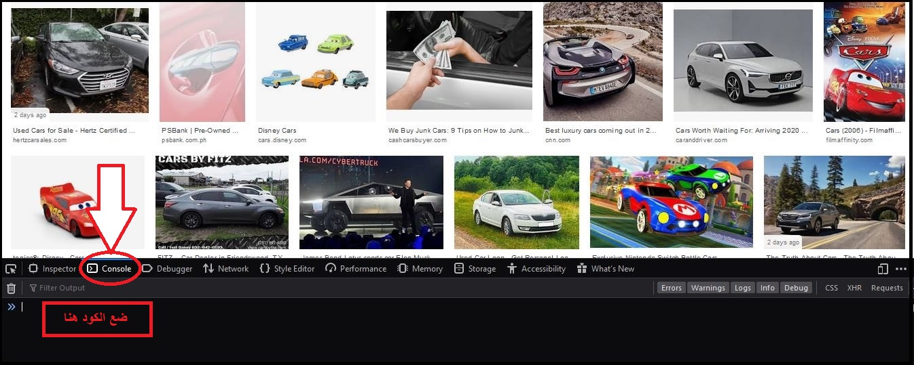

# Images-fetcher-google

## أداة بايثون لتحميل مجموعة من صور قوقل دفعة واحدة لاستخدامها في تدريب مودل الذكاء الاصطناعي.

واحدة من اهم اساسيات النجاح في الحصول على معدل دقة عالية في الذكاء الاصطناعي هو توفر بيانات ممتازة. لو اردت تدريب مودل على التمييز بين نوعين مختلفين من المركبات على سبيل المثال, فان هذه الاداة سوف تساعدك على الحصول على الديتا (الصور) المطلوبة للتدريب. 

## خطوات الحصول على الصور: 

- البحث عن الصور المطلوبة في قوقل
- استخدام صفحة الكونسل  للحصول على روابط جميع الصور المطلوبة
- استخدام باثون لحفظ هذه الصور على الجهاز

لنبدأ. اذهب لمتصفح كروم او فايرفوكس وابحث عن الصور المراد تحميلها ثم انزل بالصفحة الى الحد المطلوب من الصور
افتح ال انسبيكت بيج واذهب الى الكونسل واعمل رن للاكواد التالية بالترتيب واحد تلو الاخر. 

 1-   var script = document.createElement('script');
      script.src = "https://ajax.googleapis.com/ajax/libs/jquery/2.2.0/jquery.min.js";
      document.getElementsByTagName('head')[0].appendChild(script);

2-    var urls = $('.rg_di .rg_meta').map(function() { return JSON.parse($(this).text()).ou; });

3-    var textToSave = urls.toArray().join('\n');
      var hiddenElement = document.createElement('a');
      hiddenElement.href = 'data:attachment/text,' + encodeURI(textToSave);
      hiddenElement.target = '_blank';
      hiddenElement.download = 'urls.txt';
      hiddenElement.click();
      
     
   
(urls.txt) :تأكد من نسخ الاكواد اعلاه بدقه. بعد اتباع الخطوات اعلاه بنجاح سيتم تحميل ملف تكس وسيحمل الاسم التالي
 ضع الملف المحمل بدلا من الملف الموجود في هذه الريبوسيتري ليتم تحميل صورك المختاره من قوقل.
 
 
 
 
